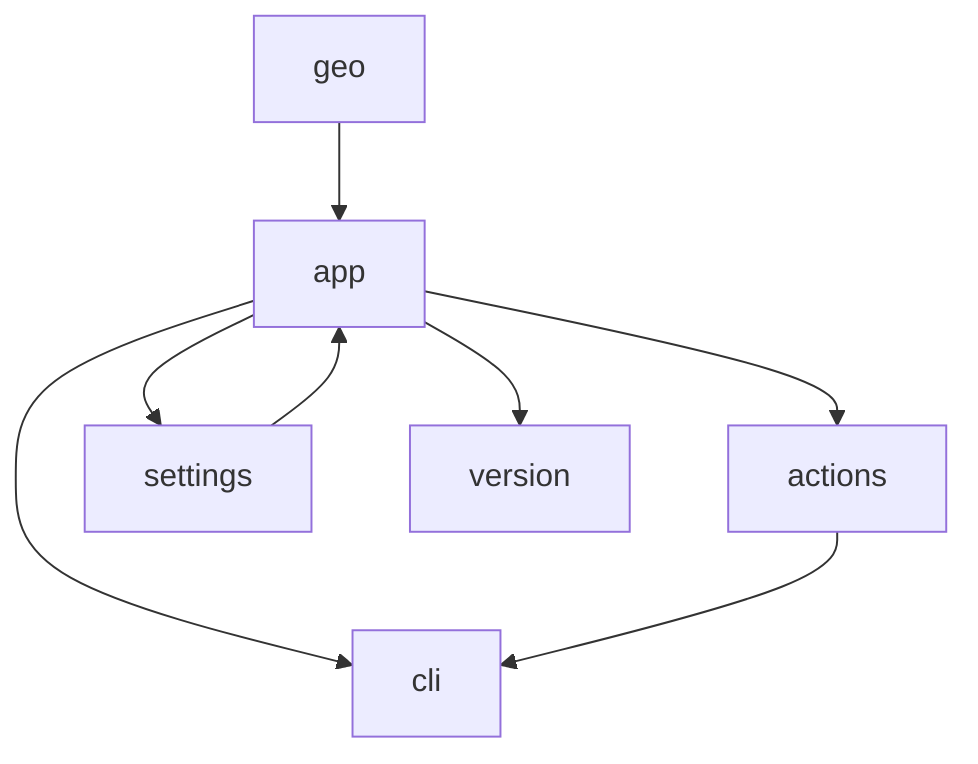
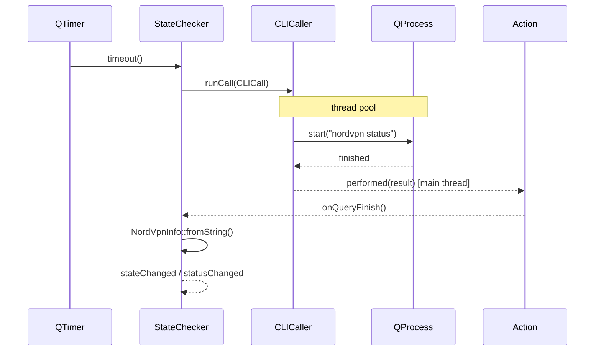
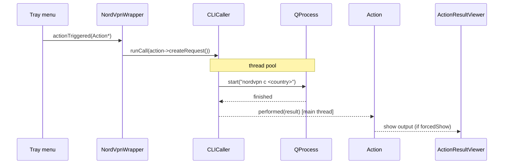
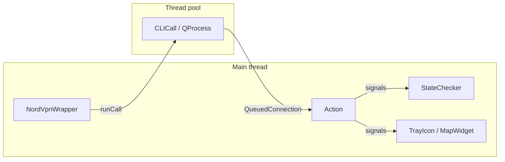

# yangl — Architecture overview

## Module layout

```
src/
  app/        — application core: lifecycle, tray, state machine, update check
  actions/    — action model, storage, result viewer
  cli/        — subprocess abstraction (CLICaller / CLICall)
  geo/        — map widget, server list, place model
  settings/   — persistent settings (AppSettings) and settings dialog
  version/    — build-time version info and VersionTriplet type
```

No circular dependencies between modules:



## Key classes

### NordVpnWrapper (`app/`)
The application root. Owns every major subsystem as a member and wires their
signals together. Constructed once via `NordVpnWrapper::instance()` and lives
for the entire process lifetime.

### StateChecker (`app/`)
Periodic VPN state monitor. Dispatches a `CLICall` on a timer, parses the
output into a `NordVpnInfo`, and emits `stateChanged` / `statusChanged`.
Supports two polling modes:
- **Dynamic** — 1 s while transitioning, 5 s when stable. Uptime is ticked
  locally between polls so the tooltip stays live.
- **Custom** — fixed user-defined interval.

An in-flight guard prevents overlapping polls; after 3 consecutive errors the
monitor stops.

### ActionStorage (`actions/`)
Registry and JSON persistence for all actions. Three flows:
- **Yangl** — internal controls (Show Map, Quit, …)
- **NordVPN** — predefined `nordvpn` CLI wrappers
- **Custom** — user-defined executables / scripts

Single source of truth; provides typed lookup by enum value or UUID.

### CLICaller / CLICall (`cli/`)
`CLICall` encapsulates one subprocess invocation (path + args + timeout).
`CLICaller::runCall()` submits it to Qt's global thread pool, keeping the GUI
thread free. Results are delivered back on the main thread via `Action::performed`.

### UpdateChecker (`app/`)
Queries the GitHub Releases API asynchronously and compares the latest tag
against the running build version. Emits `updateAvailable` once and caches
the result for late-subscribing widgets. Silently ignores network errors and
404s.

## Data flow — status poll cycle



## Data flow — user action (e.g. Connect)



## Settings persistence

`AppSettings` is a thin typed wrapper over `QSettings`. Each leaf is a
`Setting<T>` with a compile-time key and default; `read()` / `write()` are the
only interface. Settings are grouped into `GroupMonitor`, `GroupTray`, and
`GroupMap` namespaces.

## Threading model

All objects live on the main thread. `CLICaller` uses `QtConcurrent::run` to
execute each `CLICall` on a pool thread; results are marshalled back via
`QMetaObject::invokeMethod(..., Qt::QueuedConnection)`. No explicit mutexes
are needed.


