

# yangl
### **Y**et **A**nother **N**ordVPN **G**UI for **L**inux

This is unofficial GUI for [NordVPN](https://nordvpn.com/) desktop client.
It's written for my own purpose, and I'm not affiliated to the [NordVPN](https://nordvpn.com/) team in no way. Used titles, logo and so on are the property of legal rights holders. The [NordVPN](https://nordvpn.com/) has no responsibility for this application nor the results of its usage. Neither I have:

> [GNU LGPL v.3](https://www.gnu.org/licenses/lgpl-3.0.html>): 
> This application is distributed in the hope that it will be useful, but **WITHOUT ANY WARRANTY**; without even the implied warranty of **MERCHANTABILITY** or **FITNESS FOR A PARTICULAR PURPOSE**.

# Features
Being too lazy to use the provided CLI or even to bind it to keyboard shortcuts, I wanted a quick way to get the connection status or setup/break the connection with a few mouse clicks. These, basically, are the main features placed in the system tray:

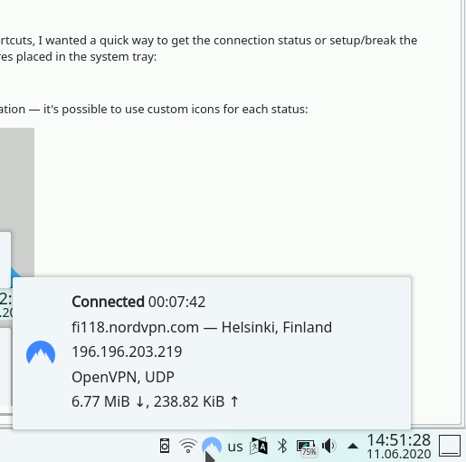

To fit with arbitrary desktop theming, ***yangl*** supports tray icon customization &mdash; it's possible to use custom icons for each status:

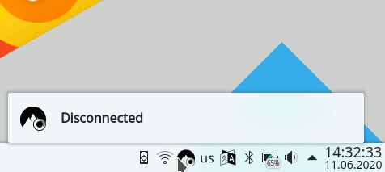

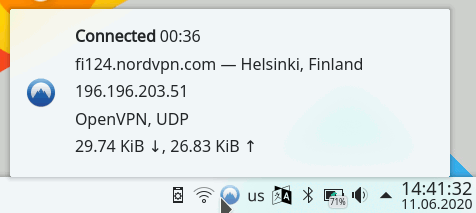

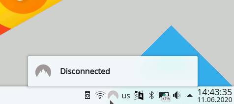

yangl's context menu provides three type of actions — the "yangl", "NordVPN" and "Extra". First one are internal actions to manage the yangl itself, others are just wrappers on an application and its command line arguments to be called with ­­&mdash; nordvpn or any arbitrary application/script.

## NordVPN actions
It's a list of predefined wrappers (and its combinations) for existent [NordVPN](https://nordvpn.com/) switches, llike Connect, Disconnect, turn KillSwitch On/Off or Rate connection, etc.

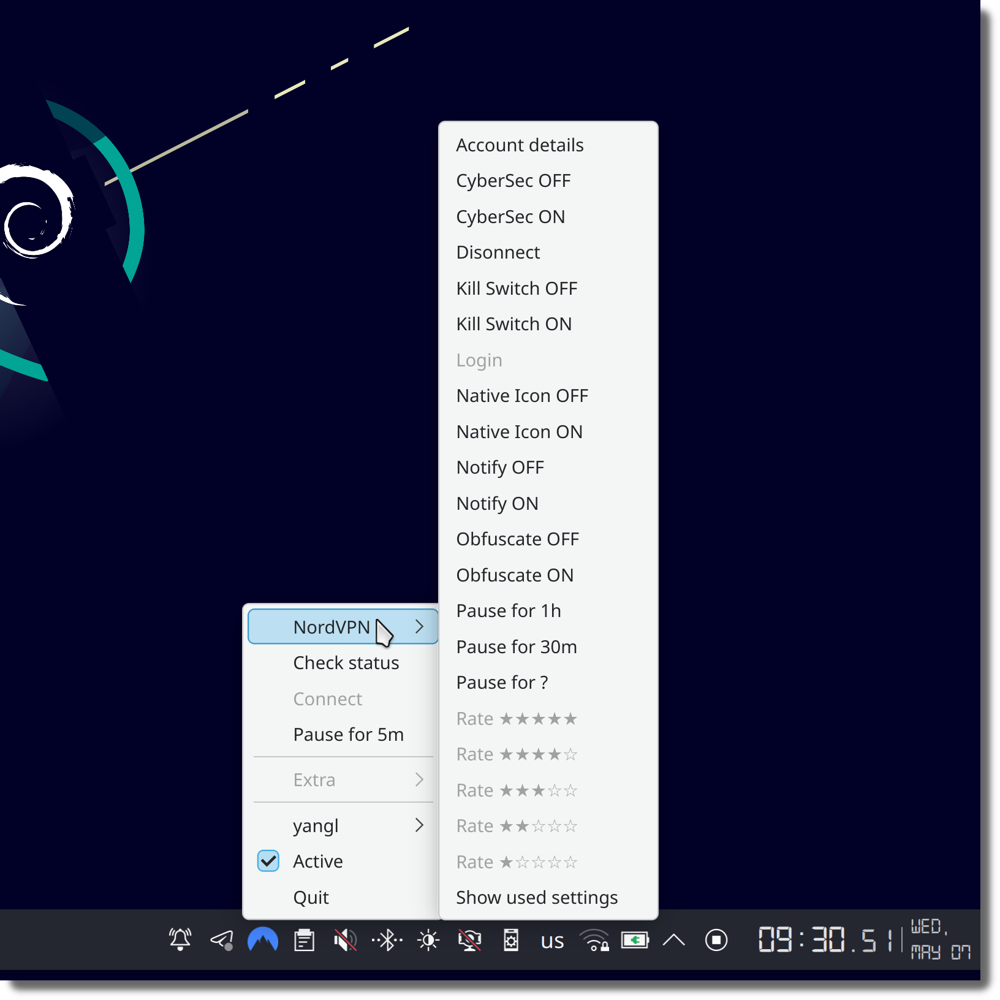

## Extra actions
An ability to run your own application/script. 
In my case, the [NordVPN](https://nordvpn.com/) client some time stops working after hibernation and it's the place to restart it with a single click:

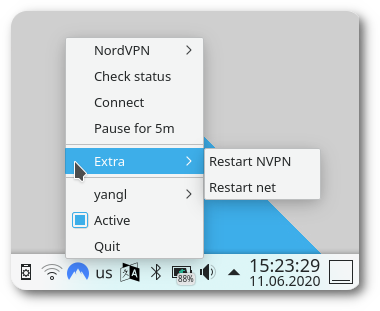

## Action configuration
It's possible to configure any action in runtime:

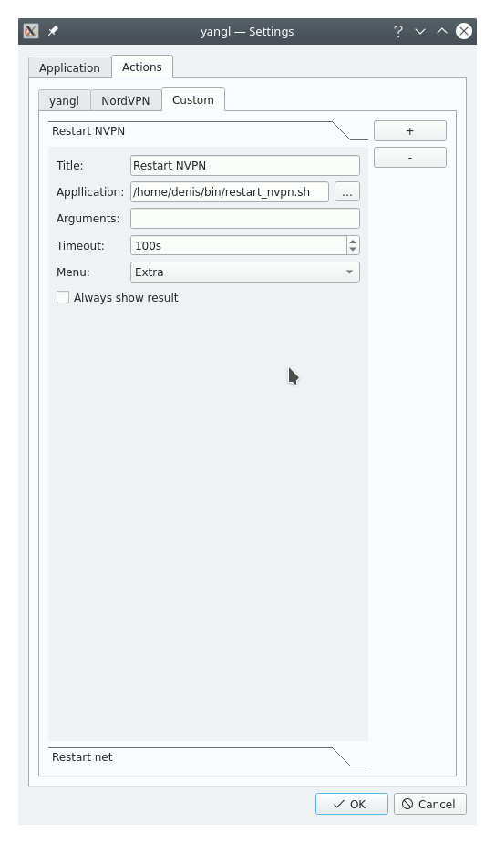

* ***Title*** — action's visible title; 
* ***Application*** — path to executable to be run;
* ***Arguments*** — list of parameters to pass to the application;
* ***Timeout*** — interval to wait for target application to be launched and/or to get any output from it;
* ***Menu*** — where to put the action in the tray icon menu. Each action can be placed in its related submenu, in the root context menu itself or hidden at all;
* ***Always show result*** — The result of performing of most of the actions is... Well, just performed action. There is no any text output I'm interested in or there is a dedicated GUI to display it. But some of actions are just requests for text info — like Show used settings or Account details. This flag is to define, should the text output displayed after each run or not. If not set, the result would be shown only in case of error (non zero exit code or application crash).

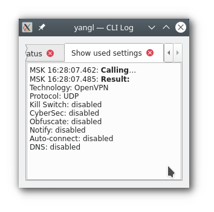

The actual set of fields to be configured depends on the action type:

* For ***yangl*** you can only change the menu anchoring; actions like *Show Settings* or *Quit* can not be hidden;
* For all ***NordVPN*** actions the ***Application*** is configured in yangl's settings;
* ***Extra*** actions are totally editable.

## Geo chart

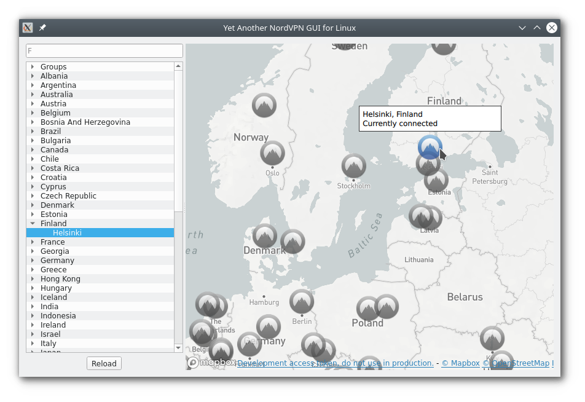

Simple map UI that allows to select location of the target [NordVPN](https://nordvpn.com/) server. Contains a list of available groups, countries and cities — no servers. I did not find the way to get it through the CLI and I'm too lazy to grab it from the [NordVPN web site](https://nordvpn.com/).

## Hints
While most of builtin actions are pretty straightforward, here are some notes/hints.
### Login/Logout
First of all, I don't want to bother with anything related to sensetive information, so there are no tools to manage the account. Please, handle your login/password by yourself within the good old CLI :)

### Pausing
Sometime it's necessary to temporarry switch the VPN off to access some (rarely visited) local resources or to run torrent, or whatever. Here are the Pause actions for this purpouse — use one of the predefined intervals or type your own one.

### Balloons flood

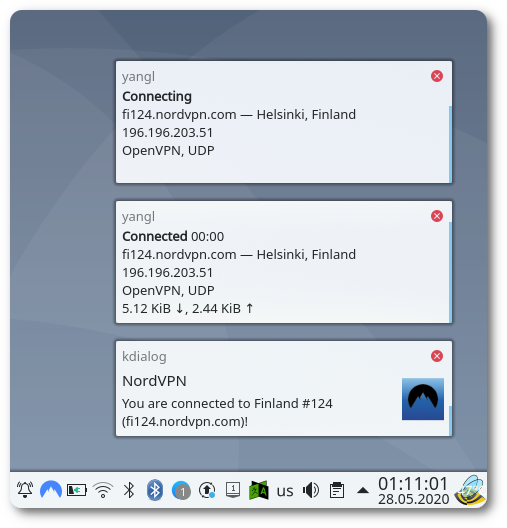

To avoid being spammed by balloon messages on reconnection you may want to switch off NordVPN's notification. Or may not. It's up to you. But it's impossible to switch off yangl's norifications, at least for now.

### Tray Icon Tooltip
Shows advanced info about current connection — used server, uptime and so on:

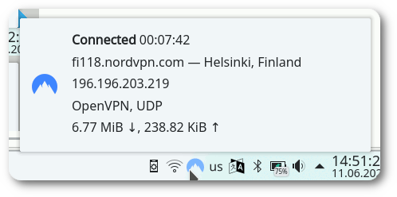

# Build
See [BUILD.md](./BUILD.md)

# Install 
See [INSTALL.md](./INSTALL.md) **(TBD)**
