

# yangl

### **Y**et **A**nother **N**ordVPN **G**UI for **L**inux

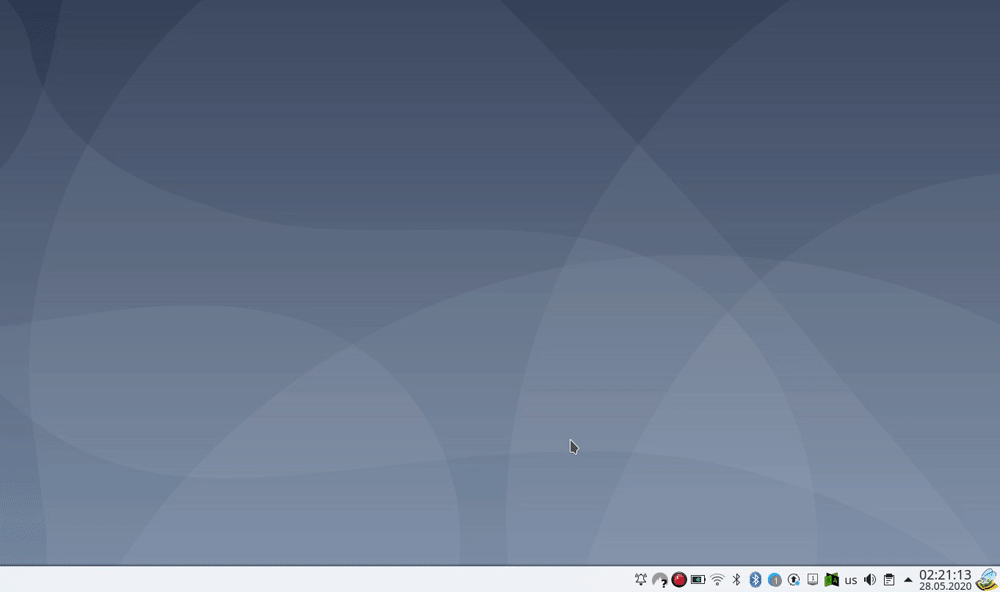

**TL;DR: [BUILD.md](./BUILD.md)**

## Overview

- [Features](#toc-features)
  - [Tray icon](#toc-tray-icon-customizable)
  - [NordVPN actions](#toc-nordvpn-actions)
  - [Custom actions](#toc-extra-actions)
  - [Action configuration](#toc-action-configuration)
  - [Geo chart](#toc-geo-chart)
  - [Update notifications](#toc-update-notifications)
- [Notes](#toc-notes)
  - [NordVPN integration](#toc-nordvpn-integration)
  - [Reliability](#toc-reliability-test-scope)
  - [Login](#toc-login)
  - [Pausing](#toc-pausing)
  - [Balloons flood](#toc-balloons-flood)
  - [Tray icon](#toc-tray-icon)
  - [Polling](#toc-polling)
- [Build](#toc-build)
- [Contributing / Development](#toc-contributing-development)

This is an unofficial GUI for the [NordVPN CLI](https://nordvpn.com/download/linux/) desktop client.
It is written for my own needs, and I am not affiliated with the [NordVPN](https://nordvpn.com/) team in any way. Used names, logos, and related assets are the property of their legal rights holders. [NordVPN](https://nordvpn.com/) has no responsibility for this application or for the results of using it.

> [GNU LGPL v.3](https://www.gnu.org/licenses/lgpl-3.0.html):
> This application is distributed in the hope that it will be useful, but **WITHOUT ANY WARRANTY**; without even the implied warranty of **MERCHANTABILITY** or **FITNESS FOR A PARTICULAR PURPOSE**.

# Features

Being too lazy to use the provided [CLI](https://nordvpn.com/download/linux/) (or even bind it to keyboard shortcuts), I wanted a quick way to check connection state and connect/disconnect in a few clicks. These are the main features exposed in the system tray:

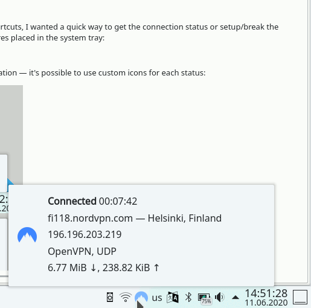

## Customizable & informative tray icon

To fit arbitrary desktop themes, ***yangl*** supports tray icon customization. For each status:

* Unknown;
* Connecting;
* Connected;
* <s>Disconnecting;</s> &mdash; Not implemented (yet?)
* Disconnected

it is possible to use custom icons. You can set an arbitrary image as the main tray icon, and/or an additional informative sub-icon rendered in the bottom-right quarter:

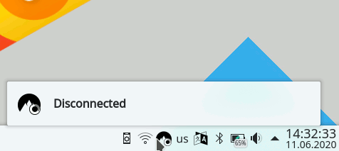

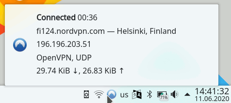

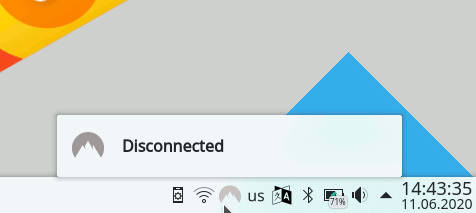

**yangl**'s context menu provides three types of actions: *yangl*, *NordVPN*, and *Extra*. The first group contains internal **yangl** actions. The other two are wrappers around an executable and arguments, typically [NordVPN CLI](https://nordvpn.com/download/linux/) or any custom application/script.

## NordVPN actions

This is a list of predefined wrappers (and their combinations) for available [NordVPN](https://nordvpn.com/download/linux/) switches, like *Connect*, *Disconnect*, *Kill Switch On/Off*, *Rate connection*, and more.

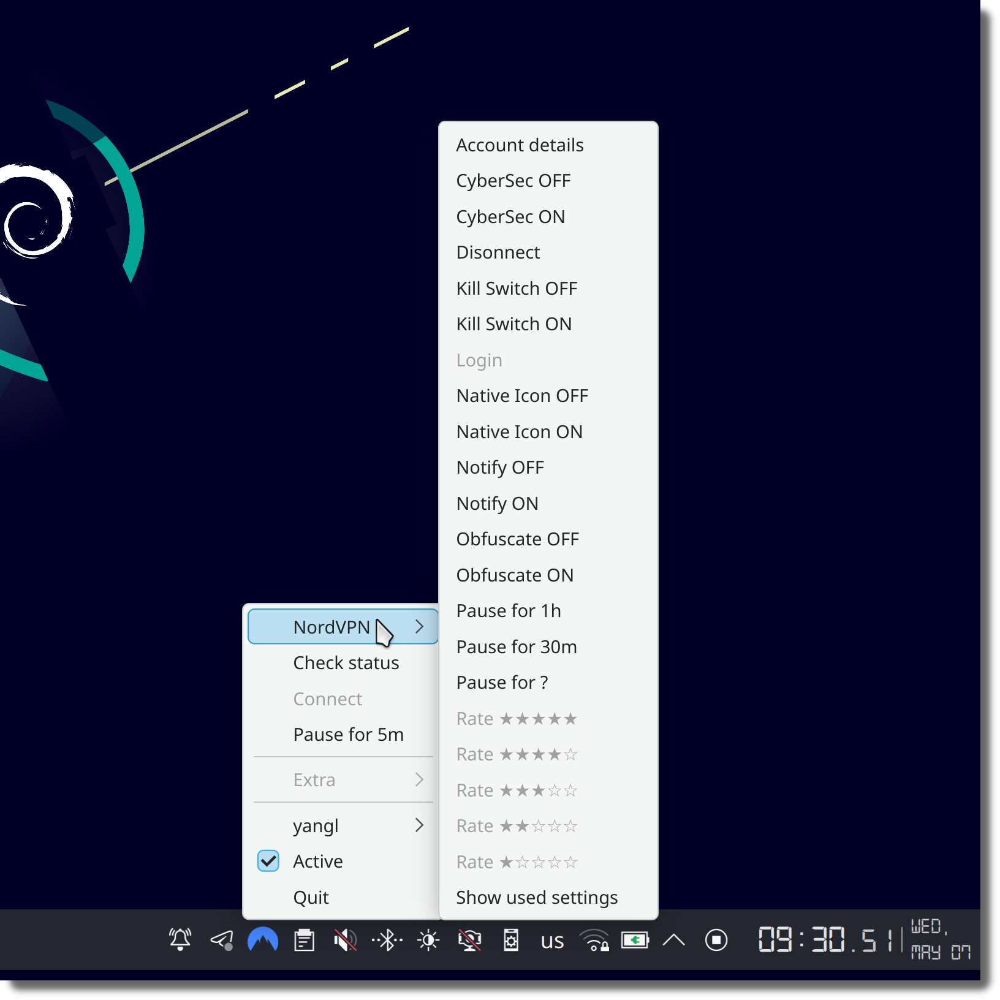

## Extra actions

An ability to run your own application/script.
In my case, the [NordVPN](https://nordvpn.com/) client sometimes stops working after hibernation, and this menu lets me restart it with a single click:

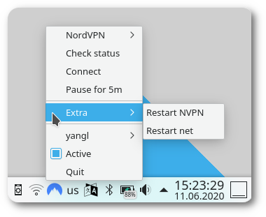

## Action configuration

Any action can be configured at runtime:

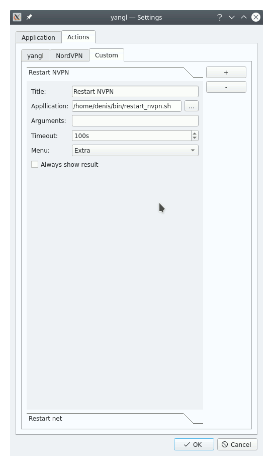

* ***Title*** — visible action title;
* ***Application*** — path to the executable;
* ***Arguments*** — list of parameters passed to the executable;
* ***Timeout*** — time to wait for the target application to start and return output;
* ***Menu*** — where to place the action in the tray menu (submenu, root menu, or hidden);
* ***Always show result*** — many actions are operational and don't need output every time. For info-style actions (for example *Show used settings* or *Account details*), this flag controls whether output is always shown. If disabled, output is shown only on errors (non-zero exit code or crash).

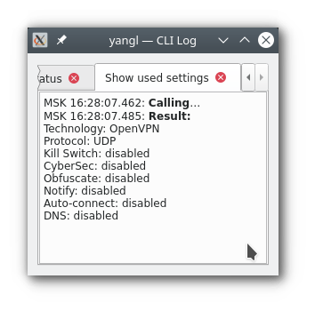

The set of configurable fields depends on action type:

* For ***yangl*** actions, you can only change menu anchoring; actions like *Show Settings* or *Quit* cannot be hidden;
* For ***NordVPN*** actions, ***Application*** is configured globally in yangl settings;
* ***Extra*** actions are fully editable.

## Geo chart

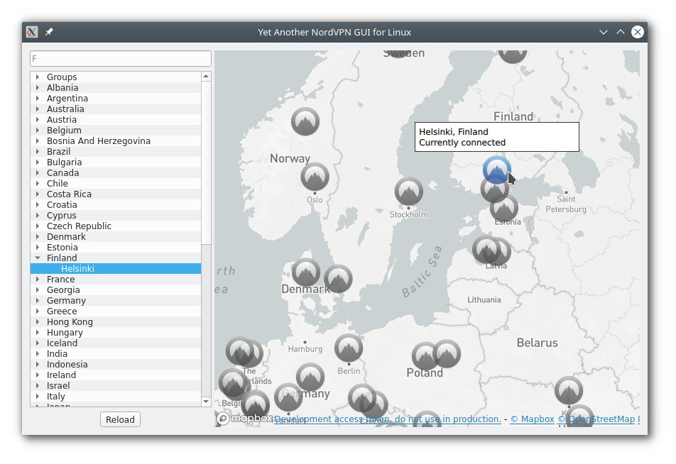

A simple map UI that allows selecting a target [NordVPN](https://nordvpn.com/) server location. It contains available groups, countries, and cities (no concrete servers). I did not find a way to get server-level locations from the CLI, and I did not want to scrape the [NordVPN website](https://nordvpn.com/).

## Update notifications

**yangl** periodically checks [GitHub Releases](https://github.com/sendevent/yangl/releases) for a newer version. When one is found, it appears in three places: a tray balloon, a tray menu entry, and a dismissible banner in both the map view and the settings dialog — each linking directly to the release page. Checking can be disabled in *Settings → Check for updates*.

## Notes

### A word on the NordVPN integration

NordVPN exposes no public API or SDK for third parties. **yangl** wraps the official `nordvpn` CLI and parses its text output. This is a conscious tradeoff: it keeps the implementation simple and dependency-free, but output format changes in future NordVPN releases may require parser updates.

### Reliability & test scope

The project includes unit tests for core logic (actions, CLI wrappers, state checker, update checker, menu behavior, and geo helpers), and CI runs formatting checks plus test/build jobs for Debian/Fedora/AppImage packaging.

At the same time, real runtime behavior still depends on external components:

* output format and behavior of the `nordvpn` CLI;
* desktop environment behavior for tray APIs, notifications, and rich-text tooltips.

If upstream CLI output changes, **yangl** may require parser updates.

### Login

I do not want to handle sensitive data, so there are no account-management tools in the app. Please handle login/password directly through the CLI.

### Pausing

In some (rare) cases it is useful to temporarily disable VPN access for selected resources or workflows. *Pause* actions are provided for this: use predefined intervals or enter a custom one. If you have a recurring list of LAN resources (for example a printer or router UI), consider using NordVPN's whitelist. There is no dedicated whitelist UI yet; see `nordvpn whitelist add --help`.

### Balloons flood

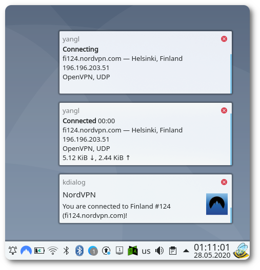

To avoid balloon spam on reconnection, you may want to disable [NordVPN](https://nordvpn.com/)'s own notifications. **yangl** notifications are currently always on.

### Tray icon

Tray messages and tooltip (when in *Connected* state) provide extended connection info — used server, uptime, and more. By default this is rich text; if your desktop environment does not support it, switch to plain text:

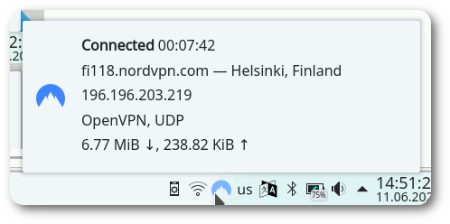

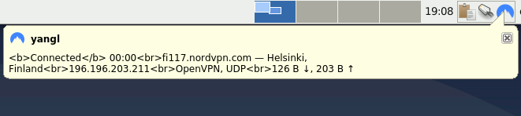

### Polling

State monitoring uses *dynamic polling*: every second while transitioning (connecting/disconnecting), then every 5 seconds once stable. A *Custom* fixed interval can be set in *Settings*.

# Build

See [BUILD.md](./BUILD.md)

# Contributing / Development

See [ARCHITECTURE.md](./ARCHITECTURE.md) for a module overview and key data-flow diagrams.

See the [For developers](./BUILD.md#for-developers) section in BUILD.md for how to build with tests enabled and run the test suite. The project uses clang-format; CI enforces formatting on every push.
