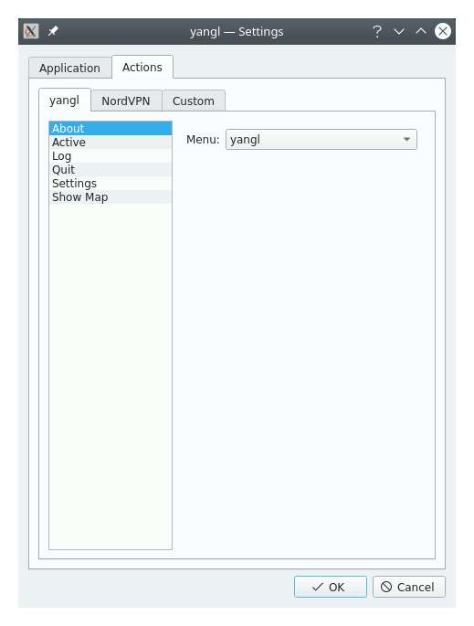

# yangl

### **Y**et **A**nother **N**ordVPN **G**UI for **L**inux

**TL;DR: [BUILD.md](./BUILD.md)**

This is unofficial GUI for [NordVPN CLI](https://nordvpn.com/download/linux/) desktop client.
It is written for my own purpose, and I am not affiliated to the [NordVPN](https://nordvpn.com/) team in no way. Used titles, logo and so on are the property of legal rights holders. The [NordVPN](https://nordvpn.com/) has no responsibility for this application nor the results of its usage. Neither I have:

> [GNU LGPL v.3](https://www.gnu.org/licenses/lgpl-3.0.html>): 
> This application is distributed in the hope that it will be useful, but **WITHOUT ANY WARRANTY**; without even the implied warranty of **MERCHANTABILITY** or **FITNESS FOR A PARTICULAR PURPOSE**.

# Features
Being too lazy to use the provided [CLI](https://nordvpn.com/download/linux/) or even to bind it to keyboard shortcuts, I wanted a quick way to get the connection status or setup/break the connection with a few mouse clicks. These, basically, are the main features placed in the system tray:

## Customizable & informative tray icon

To fit with arbitrary desktop theming, ***yangl*** supports tray icon customization. For each status

* Unknown;
* Connecting;
* Connected;
* <s>Disconnecting;</s> &mdash; Not implemented (yet?)
* Disconnected

it is possible to use custom icon. You can set arbitrary image as a main icon for the system tray entry, and/or an additional informative sub-icon to be rendered in the bottom-right quarter:

**yangl**'s context menu provides three type of actions — the *yangl*, *NordVPN* and *Extra*. First one is for internal actions to manage the **yangl** itself, others are just wrappers on an application and its command line arguments to be called with ­­&mdash; [NordVPN CLI](https://nordvpn.com/download/linux/) or any arbitrary application/script.

## NordVPN actions
It's a list of predefined wrappers (and its combinations) for existent [NordVPN](https://nordvpn.com/download/linux/) switches, llike *Connect*, *Disconnect*, turn *KillSwitch On/Off* or *Rate connection*, etc.

## Extra actions
An ability to run your own application/script. 
In my case, the [NordVPN](https://nordvpn.com/) client some time stops working after hibernation and it's the place to restart it with a single click:

## Action configuration
It's possible to configure any action in runtime:

* ***Title*** — action's visible title; 
* ***Application*** — path to an executable to be run;
* ***Arguments*** — list of parameters to pass to that executable;
* ***Timeout*** — interval to wait for target application to be launched and to get its output;
* ***Menu*** — where to put the action in the tray icon menu. Each action can be placed in its related submenu, in the root menu or hidden at all;
* ***Always show result*** — The result of performing of most of the actions is... Well, just performed action. There is no any text output I'm interested in or there is a dedicated GUI to display it. But some of actions are just requests for text info — like *Show used settings* or *Account details*. This flag is to define, should the text output be displayed on each run or not. If not set, the result would be shown only in case of error (non zero exit code or application crash).

The actual set of configurable fields depends on the action type:

* For ***yangl*** you can only change the menu anchoring; actions like *Show Settings* or *Quit* can not be hidden;
* For all ***NordVPN*** actions the ***Application*** is configured in yangl's settings;
* ***Extra*** actions are totally editable.

## Geo chart

Simple map UI that allows to select location of the target [NordVPN](https://nordvpn.com/) server. Contains a list of available groups, countries and cities — no servers. I did not find the way to get it through the CLI and I'm too lazy to grab it from the [NordVPN web site](https://nordvpn.com/).

## Notes

### Login

I don't want to bother with anything related to sensitive data, so there are no tools to manage the account. Please, handle your login/password by yourself within the good old CLI :)

### Pausing

In some (rare) cases it's necessary to temporarry switch the VPN off to access some web resources or to run torrent, or whatever. Here are the *Pause* actions for this purpouse — use one of the predefined intervals or type your own one. If you have a list of such resources (e.g., a printer on your LAN or router's web interfafe) &mdash; consider adding it to the white list. There is no UI for this (yet?), see `nordvpn whitelist add --help` for details.

### Balloons flood

To avoid being spammed by balloon messages on reconnection you may want to switch off [NordVPN](https://nordvpn.com/)'s notification. Or may not. It's up to you. But it's impossible to switch off **yangl**'s norifications, at least for now.

### Tray Icon
Its messages and tooltip (when in *Connected* state) provide advanced info about current connection — used server, uptime, and so on. By default that is in rich text format, but if your Desktop Environment does not support it, you can switch to the plain text:

# Build
See [BUILD.md](./BUILD.md)

# Install 
See [INSTALL.md](./INSTALL.md) **(TBD)**
